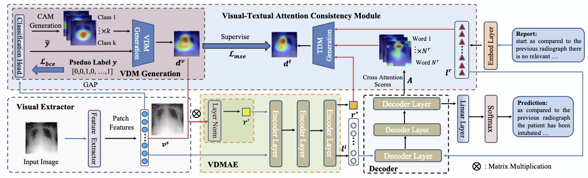

# XProNet

This is the official implementation of [CAMANet: Class Activation Map Guided Attention Network for Radiology Report Generation](https://arxiv.org/pdf/2211.01412.pdf) accepted to  IEEE Journal of Biomedical and Health Informatics (J-BHI), 2023.

## Abstract

Radiology report generation (RRG) has gained increasing research attention because of its huge potential to mitigate  medical resource shortages and aid the process of disease decision making by radiologists. Recent advancements in RRG are largely driven by improving a model's capabilities in encoding single-modal feature representations, while few studies explicitly explore the cross-modal alignment between image regions and words. Radiologists typically focus first on abnormal image regions before composing the corresponding text descriptions, thus cross-modal alignment is of great importance to learn a RRG model which is aware of abnormalities in the image. Motivated by this, we propose a Class Activation Map guided Attention Network (CAMANet) which explicitly promotes cross-modal alignment by employing aggregated class activation maps to supervise cross-modal attention learning, and simultaneously enrich the discriminative information. CAMANet contains three complementary modules: a Visual Discriminative Map Generation module to generate the importance/contribution of each visual token; Visual Discriminative Map Assisted Encoder to learn the discriminative representation and enrich the discriminative information; and a Visual Textual Attention Consistency module to ensure the attention consistency between the visual and textual tokens, to achieve the cross-modal alignment. Experimental results demonstrate that CAMANet outperforms previous SOTA methods on two commonly used RRG benchmarks.



## Citations

If you use or extend our work, please cite our paper.
```
@article{wang2022camanet,
  title={CAMANet: Class Activation Map Guided Attention Network for Radiology Report Generation},
  author={Wang, Jun and Bhalerao, Abhir and Yin, Terry and See, Simon and He, Yulan},
  journal={arXiv preprint arXiv:2211.01412},
  year={2022}
}
```

## Prerequisites

The following packages are required to run the scripts:
- [Python >= 3.6]
- [PyTorch = 1.6]
- [Torchvision]
- [Pycocoevalcap]

* You can create the environment via conda:
```bash
conda env create --name [env_name] --file env.yml
```


## Download Trained Models
You can download the trained models [here](https://drive.google.com/drive/folders/1iv_SNS6GGHKImLrFITdScMor4hvwin77?usp=sharing).

## Datasets
We use two datasets (IU X-Ray and MIMIC-CXR) in our paper.

For `IU X-Ray`, you can download the dataset from [here](https://openi.nlm.nih.gov/faq).

For `MIMIC-CXR`, you can download the dataset from [here](https://physionet.org/content/mimic-cxr/2.0.0/).

After downloading the datasets, put them in the directory `data`.

## Pseudo Label Generation
You can generate the pesudo label for each dataset by leveraging the automatic labeler  [ChexBert](https://github.com/stanfordmlgroup/CheXbert).

We also provide the generated labels in the files directory.

Our experiments on IU X-Ray were done on RTX A6000 card.

## Experiments on IU X-Ray

Run `bash run_iu_xray.sh` to train a model on the IU X-Ray data.

## Run on MIMIC-CXR

Run `bash run_mimic_cxr.sh` to train a model on the MIMIC-CXR data.


## Acknowledgment
Our project references the codes in the following repos. Thanks for their works and sharing.
- [R2GenCMN](https://github.com/cuhksz-nlp/R2GenCMN)
